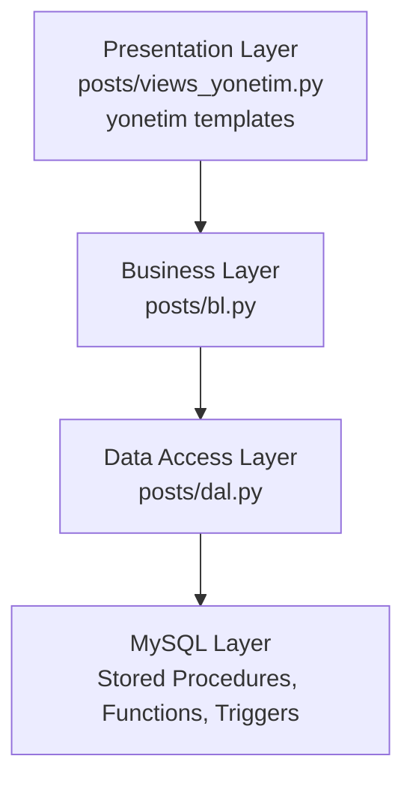

# FitRehber Yönetim Sistemi

FitRehber Yönetim Sistemi, fitness, beslenme ve sağlıklı yaşam odağındaki içerik ve topluluk verilerini yönetmek için geliştirilmiş Django + MySQL tabanlı bir yönetim panelidir. Projenin yönetim modülü katı bir N-Tier mimariyle tasarlanmıştır: sunum katmanı iş mantığını çağırır, iş mantığı veri erişim katmanını kullanır, veri erişim katmanı ise MySQL tarafındaki stored procedure'ları çalıştırır.

Bu repository, Windows üzerinde tek dosyayla kurulup çalıştırılabilecek şekilde hazırlanmıştır. Demo veritabanı, örnek medya dosyaları, ER diyagramı, SQL şeması, stored procedure, function ve trigger paketleri repository içinde yer alır.


## İçindekiler

- [Hızlı Başlangıç](#hızlı-başlangıç)
- [Çalıştırma Seçenekleri](#çalıştırma-seçenekleri)
- [Başarılı Kurulumdan Sonra](#başarılı-kurulumdan-sonra)
- [Mimari](#mimari)
- [Veritabanı Tasarımı](#veritabanı-tasarımı)
- [Stored Procedure, Function ve Trigger Envanteri](#stored-procedure-function-ve-trigger-envanteri)
- [Yönetim Paneli Haritası](#yönetim-paneli-haritası)
- [Doğrulama Komutları](#doğrulama-komutları)
- [Sorun Giderme](#sorun-giderme)
- [Dosya Yapısı](#dosya-yapısı)

## Hızlı Başlangıç

ZIP veya clone sonrası Windows üzerinde çalıştırılması gereken tek dosya:

```bat
baslat.bat
```

`baslat.bat` aşağıdaki işleri otomatik yapar:

1. Mevcut kurulum var mı kontrol eder.
2. Kurulum yoksa uygun yöntemi seçer.
3. Docker Desktop çalışıyorsa Docker yolunu kullanır ve local MySQL şifresi istemez.
4. Docker kullanılamıyorsa local MySQL yolunu kullanır ve bu bilgisayardaki MySQL yönetici bilgilerini sorar.
5. Python sanal ortamını oluşturur.
6. Paketleri kurar.
7. `.env.example` dosyasından güvenli `.env` dosyasını oluşturur.
8. Demo veritabanını kurar.
9. Migration, cache table, SQL omurgası ve demo verisini uygular.
10. Sunucuyu başlatır ve yönetim panelini tarayıcıda açar.

Başarılı açılış adresi:

```text
http://127.0.0.1:8001/yonetim-sistemi/
```

Demo kurulumda yönetim paneli `Nyancat` superuser hesabıyla otomatik açılır. Bu kolaylık yalnızca `DEBUG=True`, local host ve `/yonetim-sistemi/` rotası için aktiftir; production modunda devreye girmez.

Manuel giriş gerekirse:

```text
Kullanıcı adı: Nyancat
Şifre: demo1234
```

PowerShell kullanılıyorsa geçerli klasördeki batch dosyası şu şekilde çalıştırılır:

```powershell
.\baslat.bat
```

## Çalıştırma Seçenekleri

### Önerilen Yol: Docker Desktop

Docker Desktop kurulu ve çalışır durumdaysa `baslat.bat` otomatik olarak Docker yolunu tercih eder. Bu yöntemde bilgisayardaki mevcut MySQL kurulumuna veya MySQL root şifresine ihtiyaç yoktur.

Docker yolu ile kurulum sonrası Workbench bağlantısı:

```text
Host: 127.0.0.1
Port: 3307
User: root
Password: 123
Schema: fitrehber_yonetim_demo
```

Bu `root / 123` bilgisi yalnızca Docker container içinde oluşturulan izole demo MySQL içindir. Bilgisayarın kendi MySQL kurulumu için geçerli değildir.

### Alternatif Yol: Local MySQL

Docker Desktop çalışmıyorsa sistem local MySQL yoluna geçer. Bu yöntemde bilgisayarda şu bileşenler gerekir:

- Python 3
- MySQL Server veya MySQL Workbench
- Çalışır durumda MySQL servisi
- Bu bilgisayardaki MySQL yönetici kullanıcı adı ve şifresi

`baslat.bat` local MySQL yolunda kullanıcıdan şu bilgileri ister:

```text
MySQL yonetici kullanici adi:
MySQL yonetici sifresi:
```

Kullanıcı adı çoğu MySQL kurulumunda `root` olabilir, ancak şifre kişiye ve kuruluma göre değişir. Proje herhangi bir local MySQL şifresi varsaymaz. Şifre bilinmiyorsa Docker Desktop açılıp `baslat.bat` tekrar çalıştırılabilir.

Local MySQL yolu ile kurulum sonrası Workbench bağlantısı:

```text
Host: 127.0.0.1
Port: 3306
Schema: fitrehber_yonetim_demo
Application user: fitrehber_demo
Application password: FitRehberDemo2026!
```

İstenirse aynı şema MySQL yönetici kullanıcısıyla da incelenebilir.

### Port Seçimi

Varsayılan uygulama portu `8001` değeridir. Bu port doluysa `baslat.bat` otomatik olarak `8002-8010` aralığında boş port arar ve doğru adresi ekrana yazar.

Elle port seçmek için:

```bat
set APP_PORT=8020
baslat.bat
```

## Başarılı Kurulumdan Sonra

Kurulum tamamlandığında tarayıcıda yönetim paneli açılır:

```text
http://127.0.0.1:<secilen-port>/yonetim-sistemi/
```

Panelde aşağıdaki ana bölümler bulunur:

- Dashboard
- Kullanıcılar
- Profiller
- Kategoriler
- İçerikler
- Yorumlar
- İçerik beğenileri
- İçerik kaydetmeleri
- Yorum beğenileri

Demo veri paketi kurulumla birlikte yüklenir. Paket; kullanıcılar, profiller, kategoriler, içerikler, forum soruları, yorumlar, beğeniler, kaydetmeler ve seçili medya dosyalarından oluşur. Session, cache, OAuth token, e-posta doğrulama tokenı ve gerçek secret bilgileri demo dump içine dahil edilmez.

## Mimari

Yönetim modülü dört katmanlı bir N-Tier yapı kullanır.



Katmanların sorumlulukları:

| Katman | Dosyalar | Sorumluluk |
|---|---|---|
| Presentation | `posts/views_yonetim.py`, `posts/templates/yonetim/` | HTTP istekleri, form verileri, ekran çıktısı |
| Business Logic | `posts/bl.py` | Validasyon, hata yönetimi, iş kuralları |
| Data Access | `posts/dal.py` | Yalnızca `CALL sp_...` ile stored procedure çağırma |
| Database | `sql/parcalar/*.sql`, `sql/fitrehber_db.sql` | Parçalı DDL, stored procedure, function, trigger kaynakları ve üretilmiş kurulum paketi |

Yönetim modülü içinde Django ORM kullanılmaz. `views_yonetim.py`, `bl.py` ve `dal.py` zinciri doğrudan stored procedure tabanlıdır. DAL katmanındaki SQL ifadesi MySQL stored procedure çağırma sözdizimi olan `CALL sp_...(...)` biçimindedir.

Ana FitRehber platform sayfaları (`/`, `/forum/`, `/profil/...`) mevcut web uygulaması deneyimini göstermek için repository içinde korunur. N-Tier ve stored procedure odaklı yönetim kapsamı `/yonetim-sistemi/` rotasıdır.

## Veritabanı Tasarımı

Ana yönetim modeli 8 çekirdek tablo üzerine kuruludur.

| Tablo | Açıklama |
|---|---|
| `auth_user` | Kullanıcı kimlikleri ve yetki alanları |
| `profiller` | Kullanıcı profili, hedefler, ölçüler, ban ve timeout bilgileri |
| `kategoriler` | İçerik kategorileri |
| `icerikler` | Makale ve forum sorusu kayıtları |
| `yorumlar` | İçerik yorumları ve parent-child cevap ilişkisi |
| `icerik_begenileri` | Kullanıcı - içerik beğeni ilişkisi |
| `icerik_kaydetmeleri` | Kullanıcı - içerik kaydetme ilişkisi |
| `yorum_begenileri` | Kullanıcı - yorum beğeni ilişkisi |

Temel ilişki yapısı:

- `auth_user` 1-1 `profiller`
- `auth_user` 1-N `icerikler`
- `auth_user` 1-N `yorumlar`
- `kategoriler` 1-N `icerikler`
- `icerikler` 1-N `yorumlar`
- `yorumlar` 1-N `yorumlar` (cevap zinciri)
- `auth_user` N-N `icerikler` (`icerik_begenileri`, `icerik_kaydetmeleri`)
- `auth_user` N-N `yorumlar` (`yorum_begenileri`)

Fiziksel tasarımda kullanılan başlıca kısıtlar:

- Primary key
- Foreign key
- Unique constraint
- Not null / null düzeni
- Default değerler
- Check constraint
- Auto increment identity alanları

ER diyagram kaynakları:

- [`docs/er_diagram.drawio`](docs/er_diagram.drawio)
- [`docs/er_diagram.png`](docs/er_diagram.png)

## Stored Procedure, Function ve Trigger Envanteri

| Bileşen | Adet | Açıklama |
|---|---:|---|
| Stored Procedure | 44 | CRUD işlemleri, özel profil ban işlemi, kullanıcı çakışma kontrolü ve raporlama prosedürleri |
| User-defined Function | 3 | Yorum sayısı, kullanıcı içerik sayısı ve içerik etkileşim skoru hesapları |
| Trigger | 8 | Pasif, banlı veya timeout durumundaki kullanıcıların içerik, yorum ve etkileşim kayıtları üretmesini engelleyen DB seviyesi kurallar |

Öne çıkan function'lar:

- `fn_IcerikYorumSayisi`
- `fn_KullaniciIcerikSayisi`
- `fn_IcerikEtkilesimSkoru`

Öne çıkan raporlama prosedürleri:

- `sp_AylikEtkilesimAnalizi`
- `sp_KategoriDagilimiRaporu`

SQL omurgasının bakım yapılan kaynakları parçalara ayrılmıştır; kurulumda kullanılan birleşik dosya bu parçalardan üretilir:

```text
sql/parcalar/*.sql
sql/fitrehber_db.sql
scripts/build-sql.ps1
```

Sanitize demo verisi:

```text
sql/demo_data.sql
```

## Yönetim Paneli Haritası

| Modül | URL | İşlem Kapsamı | Stored Procedure Grubu |
|---|---|---|---|
| Dashboard | `/yonetim-sistemi/` | Genel sayılar, raporlar, function çıktıları | Raporlama SP ve function çağrıları |
| Kullanıcılar | `/yonetim-sistemi/kullanicilar/` | Listele, bul, ekle, güncelle, sil | `sp_Kullanici*` |
| Profiller | `/yonetim-sistemi/profiller/` | Listele, bul, ekle, güncelle, sil, ban | `sp_Profil*` |
| Kategoriler | `/yonetim-sistemi/kategoriler/` | Listele, bul, ekle, güncelle, sil | `sp_Kategori*` |
| İçerikler | `/yonetim-sistemi/icerikler/` | Listele, bul, ekle, güncelle, sil | `sp_Icerik*` |
| Yorumlar | `/yonetim-sistemi/yorumlar/` | Listele, bul, ekle, güncelle, sil | `sp_Yorum*` |
| İçerik beğenileri | `/yonetim-sistemi/icerik-begenileri/` | Listele, ekle, güncelle, sil | `sp_IcerikBegeni*` |
| İçerik kaydetmeleri | `/yonetim-sistemi/icerik-kaydetmeleri/` | Listele, ekle, güncelle, sil | `sp_IcerikKaydetme*` |
| Yorum beğenileri | `/yonetim-sistemi/yorum-begenileri/` | Listele, ekle, güncelle, sil | `sp_YorumBegeni*` |

## Doğrulama Komutları

### Django kontrolü

```bat
python manage.py check
python manage.py test --settings=core.test_settings
```

Beklenen sonuç:

```text
System check identified no issues
Ran 110 tests
OK
```

### MySQL Workbench doğrulaması

Kurulumdan sonra `fitrehber_yonetim_demo` şemasında aşağıdaki sorgular çalıştırılabilir.

```sql
SELECT COUNT(*) AS procedure_sayisi
FROM information_schema.ROUTINES
WHERE ROUTINE_SCHEMA = 'fitrehber_yonetim_demo'
  AND ROUTINE_TYPE = 'PROCEDURE';
-- Beklenen: 44

SELECT COUNT(*) AS function_sayisi
FROM information_schema.ROUTINES
WHERE ROUTINE_SCHEMA = 'fitrehber_yonetim_demo'
  AND ROUTINE_TYPE = 'FUNCTION';
-- Beklenen: 3

SELECT COUNT(*) AS trigger_sayisi
FROM information_schema.TRIGGERS
WHERE EVENT_OBJECT_SCHEMA = 'fitrehber_yonetim_demo';
-- Beklenen: 8

SELECT COUNT(*) AS cache_tablosu
FROM information_schema.TABLES
WHERE TABLE_SCHEMA = 'fitrehber_yonetim_demo'
  AND TABLE_NAME = 'rate_limit_cache_table';
-- Beklenen: 1
```

Demo veri sayıları sürüme göre küçük farklılıklar gösterebilir; mevcut paket 100+ kullanıcı, 70+ içerik ve 500+ yorum düzeyinde dolu bir demo ortamı kurar.

## Sorun Giderme

| Durum | Çözüm |
|---|---|
| PowerShell `/baslat.bat` komutunu tanımıyor | Geçerli klasördeki dosyalar PowerShell'de `./` veya `.\` ile çalıştırılır: `.\baslat.bat` |
| Docker Desktop kapalı | Docker Desktop uygulamasını açın, çalışır duruma gelmesini bekleyin ve `baslat.bat` dosyasını tekrar çalıştırın |
| MySQL şifresi bilinmiyor | Docker Desktop kullanın; Docker yolu local MySQL şifresi istemez |
| Python bulunamadı | Python 3 kurun ve kurulum sırasında PATH seçeneğini etkinleştirin |
| `8001` portu dolu | Script otomatik olarak `8002-8010` aralığında boş port seçer; ekranda yazan URL kullanılmalıdır |
| Kurulum yarıda kesildi | Sorun giderildikten sonra `baslat.bat` tekrar çalıştırılabilir; yalnızca `fitrehber_yonetim_demo` demo şeması sıfırlanır |
| Workbench'te şema görünmüyor | Local MySQL için port `3306`, Docker için port `3307` kullanılmalıdır |

## Dosya Yapısı

```text
FitRehber-Yonetim-Sistemi/
├─ baslat.bat                    Tek dosyalık Windows kurulum ve başlatma scripti
├─ docker-compose.yml             Docker tabanlı alternatif çalışma ortamı
├─ Dockerfile                     Django uygulama container tanımı
├─ requirements.txt               Python bağımlılıkları
├─ manage.py                      Django yönetim komutu
├─ core/                          Django proje ayarları, middleware, servisler
├─ posts/                         Uygulama, N-Tier yönetim katmanları ve template'ler
│  ├─ views_yonetim.py            Presentation layer
│  ├─ bl.py                       Business logic layer
│  └─ dal.py                      Stored procedure tabanlı data access layer
├─ sql/
│  ├─ parcalar/                   Ana SQL paketini oluşturan okunabilir parçalar
│  ├─ yardimci/                   Zorunlu olmayan rapor/görünüm SQL dosyaları
│  ├─ fitrehber_db.sql            Parçalardan üretilen çalıştırılabilir SQL paketi
│  └─ demo_data.sql               Sanitize demo veri paketi
├─ docs/
│  ├─ er_diagram.drawio           ER diyagram kaynak dosyası
│  └─ er_diagram.png              ER diyagram görseli
├─ media/                         Demo içerik ve profil görselleri
├─ veritabani_proje_raporu.md     Detaylı teknik rapor
└─ Baran_Atici.docx               Teslim formatı için hazırlanmış rapor dosyası
```

## Güvenlik ve Demo Notları

- Gerçek `.env` dosyası repository içine dahil edilmez.
- Demo dump içinde session, cache, OAuth token, gerçek e-posta doğrulama tokenı veya production secret bilgisi yoktur.
- `AUTO_LOGIN_AS=Nyancat` sadece local demo konforu içindir; `DEBUG=False` olduğunda otomatik login devre dışı kalır.
- Local MySQL yolunda script yalnızca `fitrehber_yonetim_demo` adlı demo şemasını sıfırlar. Diğer şemalara dokunmaz.
- Docker yolu local MySQL kurulumundan bağımsızdır ve kendi izole MySQL container'ını kullanır.

## Lisans ve Kullanım

Bu repository akademik/demo kullanım amacıyla hazırlanmıştır. Canlı sistemlerde kullanılmadan önce production secret yönetimi, kullanıcı yetkilendirme politikaları, HTTPS, e-posta/OAuth anahtarları ve deployment ayarları ayrıca yapılandırılmalıdır.
