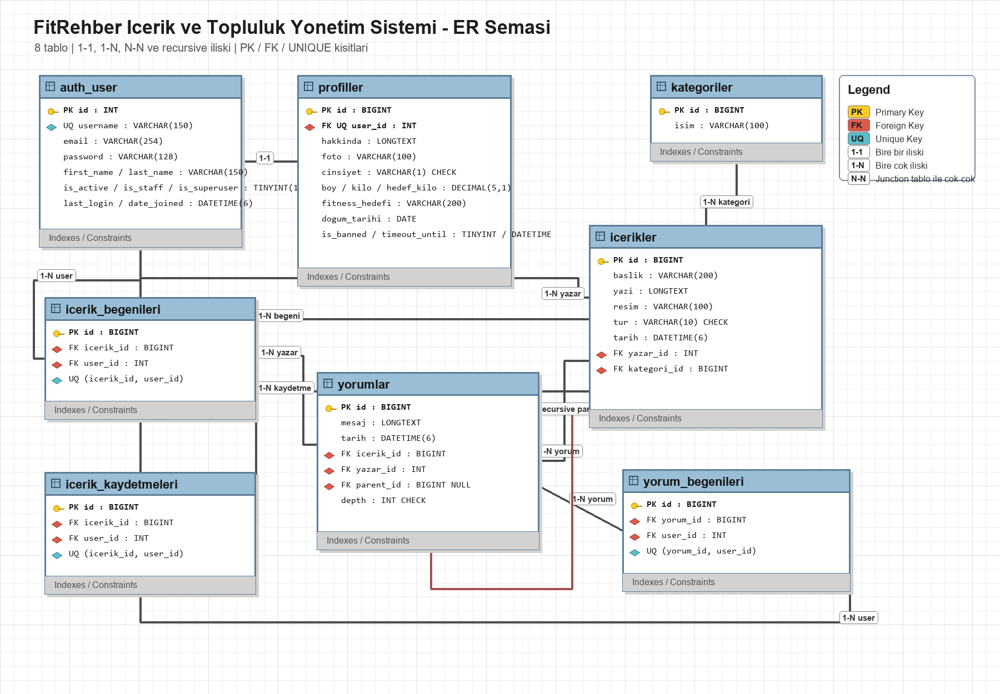
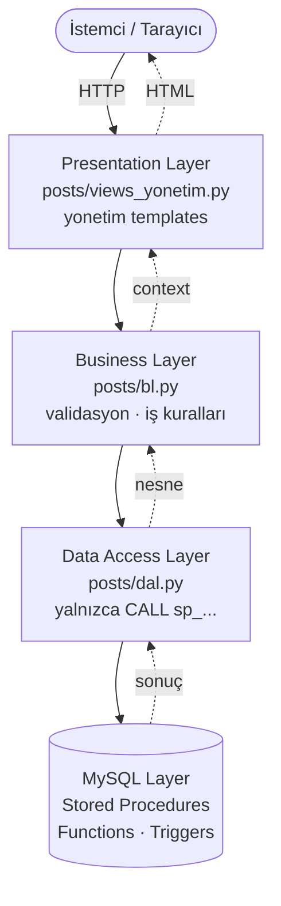
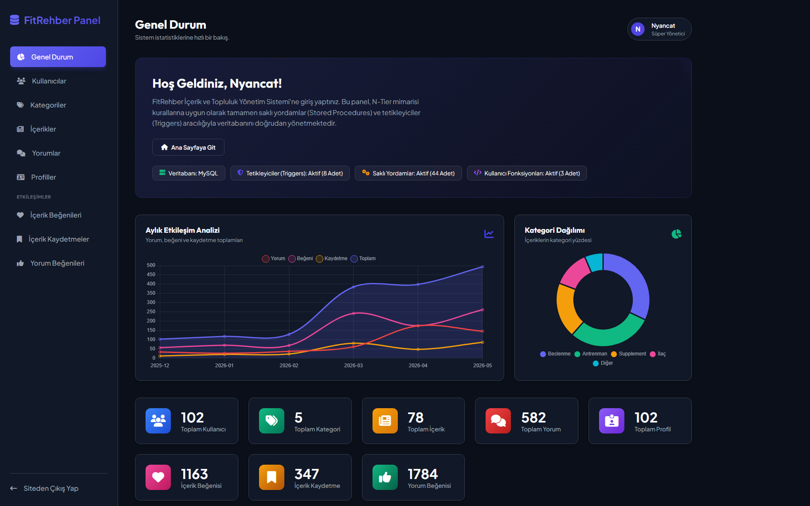
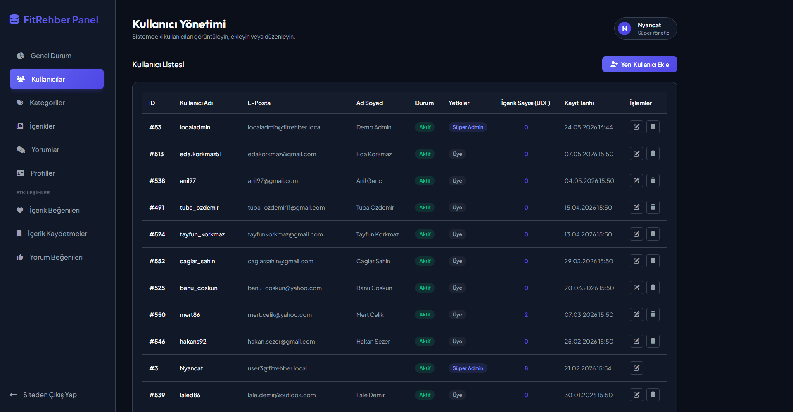
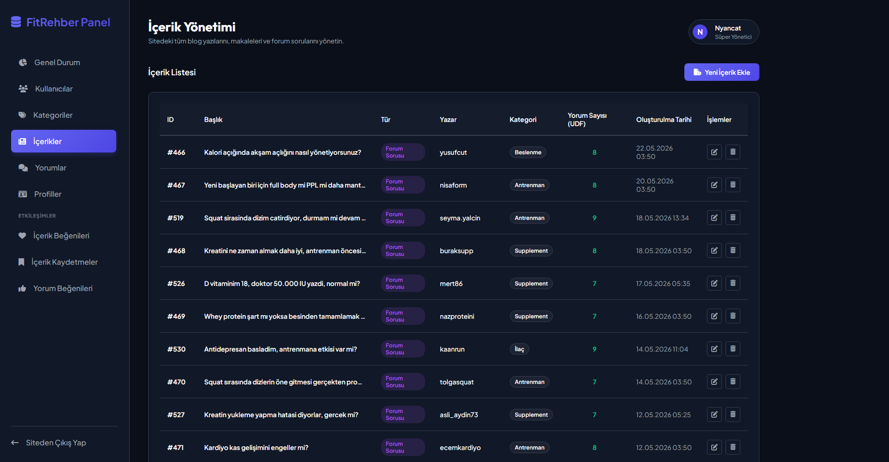
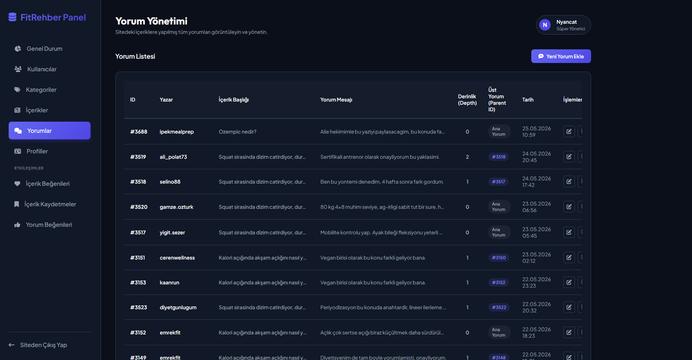

<div align="center">

# FitRehber Yönetim Sistemi

**Stored Procedure tabanlı, katı N-Katmanlı (N-Tier) mimari ile geliştirilmiş Django + MySQL yönetim paneli**

[](https://www.python.org/)
[](https://www.djangoproject.com/)
[](https://www.mysql.com/)
[](https://www.docker.com/)
[](#mimari)
[](#doğrulama-komutları)

</div>

---

FitRehber Yönetim Sistemi; fitness, beslenme ve sağlıklı yaşam odağındaki içerik ve topluluk verilerini yönetmek için geliştirilmiş, Django + MySQL tabanlı bir yönetim panelidir. Projenin yönetim modülü, veri erişiminin tamamının veritabanı tarafında kapsüllendiği **katı bir N-Katmanlı (N-Tier) mimari** ile tasarlanmıştır: sunum katmanı iş mantığını çağırır, iş mantığı veri erişim katmanını kullanır, veri erişim katmanı ise yalnızca MySQL tarafındaki **stored procedure**'ları çalıştırır.

Bu repository, Windows üzerinde **tek dosyayla** kurulup çalıştırılabilecek şekilde hazırlanmıştır. Demo veritabanı, örnek medya dosyaları, ER diyagramı, ilişkisel şema, SQL paketi ile stored procedure / function / trigger kaynaklarının tamamı repository içinde yer alır.

<div align="center">



</div>

## Öne Çıkanlar

| | |
|---|---|
| 🏛️ **N-Tier Mimari** | Presentation → Business → Data Access → Database; katmanlar arası net sorumluluk ayrımı |
| 🗄️ **%100 Stored Procedure** | Yönetim modülünde Django ORM ve ham SQL **yok**; tüm veri işlemleri `CALL sp_...` üzerinden |
| ⚙️ **44 SP · 3 Function · 8 Trigger** | CRUD, raporlama, hesaplama ve veri bütünlüğü kuralları veritabanı seviyesinde |
| 🐳 **Çift Kurulum Yolu** | Docker Desktop (önerilen, şifresiz) veya local MySQL — `baslat.bat` otomatik seçer |
| 📊 **Dashboard & BI** | Aylık etkileşim analizi, kategori dağılımı ve function tabanlı sayaçlar |
| ✅ **110 Otomatik Test** | `python manage.py test` ile doğrulanabilir test paketi |

## İçindekiler

- [Hızlı Başlangıç](#hızlı-başlangıç)
- [Çalıştırma Seçenekleri](#çalıştırma-seçenekleri)
- [Başarılı Kurulumdan Sonra](#başarılı-kurulumdan-sonra)
- [Mimari](#mimari)
- [Veritabanı Tasarımı](#veritabanı-tasarımı)
- [Stored Procedure, Function ve Trigger Envanteri](#stored-procedure-function-ve-trigger-envanteri)
- [Yönetim Paneli Haritası](#yönetim-paneli-haritası)
- [Ekran Görüntüleri](#ekran-görüntüleri)
- [Teknoloji Yığını](#teknoloji-yığını)
- [Doğrulama Komutları](#doğrulama-komutları)
- [Sorun Giderme](#sorun-giderme)
- [Proje Dokümantasyonu](#proje-dokümantasyonu)
- [Dosya Yapısı](#dosya-yapısı)
- [Güvenlik ve Demo Notları](#güvenlik-ve-demo-notları)
- [Lisans ve Kullanım](#lisans-ve-kullanım)

## Hızlı Başlangıç

ZIP veya clone sonrası Windows üzerinde çalıştırılması gereken **tek dosya**:

```bat
baslat.bat
```

`baslat.bat` aşağıdaki işleri otomatik yapar:

1. Mevcut kurulum var mı kontrol eder.
2. Kurulum yoksa uygun yöntemi seçer.
3. Docker Desktop çalışıyorsa Docker yolunu kullanır ve local MySQL şifresi istemez.
4. Docker kullanılamıyorsa local MySQL yolunu kullanır ve bu bilgisayardaki MySQL yönetici bilgilerini sorar.
5. Python sanal ortamını oluşturur.
6. Paketleri kurar.
7. `.env.example` dosyasından güvenli `.env` dosyasını oluşturur.
8. Demo veritabanını kurar.
9. Migration, cache table, SQL omurgası ve demo verisini uygular.
10. Sunucuyu başlatır ve yönetim panelini tarayıcıda açar.

Başarılı açılış adresi:

```text
http://127.0.0.1:8001/yonetim-sistemi/
```

Demo kurulumda yönetim paneli `Nyancat` superuser hesabıyla otomatik açılır. Bu kolaylık yalnızca `DEBUG=True`, local host ve `/yonetim-sistemi/` rotası için aktiftir; production modunda devreye girmez.

Manuel giriş gerekirse:

```text
Kullanıcı adı: Nyancat
Şifre: demo1234
```

PowerShell kullanılıyorsa geçerli klasördeki batch dosyası şu şekilde çalıştırılır:

```powershell
.\baslat.bat
```

## Çalıştırma Seçenekleri

### Önerilen Yol: Docker Desktop

Docker Desktop kurulu ve çalışır durumdaysa `baslat.bat` otomatik olarak Docker yolunu tercih eder. Bu yöntemde bilgisayardaki mevcut MySQL kurulumuna veya MySQL root şifresine ihtiyaç yoktur.

Docker yolu ile kurulum sonrası Workbench bağlantısı:

```text
Host: 127.0.0.1
Port: 3307
User: root
Password: 123
Schema: fitrehber_yonetim_demo
```

Bu `root / 123` bilgisi yalnızca Docker container içinde oluşturulan izole demo MySQL içindir. Bilgisayarın kendi MySQL kurulumu için geçerli değildir.

### Alternatif Yol: Local MySQL

Docker Desktop çalışmıyorsa sistem local MySQL yoluna geçer. Bu yöntemde bilgisayarda şu bileşenler gerekir:

- Python 3
- MySQL Server veya MySQL Workbench
- Çalışır durumda MySQL servisi
- Bu bilgisayardaki MySQL yönetici kullanıcı adı ve şifresi

`baslat.bat` local MySQL yolunda kullanıcıdan şu bilgileri ister:

```text
MySQL yonetici kullanici adi:
MySQL yonetici sifresi:
```

Kullanıcı adı çoğu MySQL kurulumunda `root` olabilir, ancak şifre kişiye ve kuruluma göre değişir. Proje herhangi bir local MySQL şifresi varsaymaz. Şifre bilinmiyorsa Docker Desktop açılıp `baslat.bat` tekrar çalıştırılabilir.

Local MySQL yolu ile kurulum sonrası Workbench bağlantısı:

```text
Host: 127.0.0.1
Port: 3306
Schema: fitrehber_yonetim_demo
Application user: fitrehber_demo
Application password: FitRehberDemo2026!
```

İstenirse aynı şema MySQL yönetici kullanıcısıyla da incelenebilir.

### Port Seçimi

Varsayılan uygulama portu `8001` değeridir. Bu port doluysa `baslat.bat` otomatik olarak `8002-8010` aralığında boş port arar ve doğru adresi ekrana yazar.

Elle port seçmek için:

```bat
set APP_PORT=8020
baslat.bat
```

## Başarılı Kurulumdan Sonra

Kurulum tamamlandığında tarayıcıda yönetim paneli açılır:

```text
http://127.0.0.1:<secilen-port>/yonetim-sistemi/
```

Panelde aşağıdaki ana bölümler bulunur:

- Dashboard
- Kullanıcılar
- Profiller
- Kategoriler
- İçerikler
- Yorumlar
- İçerik beğenileri
- İçerik kaydetmeleri
- Yorum beğenileri

Demo veri paketi kurulumla birlikte yüklenir. Paket; kullanıcılar, profiller, kategoriler, içerikler, forum soruları, yorumlar, beğeniler, kaydetmeler ve seçili medya dosyalarından oluşur. Session, cache, OAuth token, e-posta doğrulama tokenı ve gerçek secret bilgileri demo dump içine dahil edilmez.

## Mimari

Yönetim modülü, sorumlulukları katı şekilde ayrılmış dört katmanlı bir N-Tier yapı kullanır. Bir HTTP isteği, yalnızca bir alttaki katmanla konuşacak şekilde aşağı doğru ilerler; veriye erişim yalnızca en alttaki MySQL katmanında, stored procedure'lar aracılığıyla gerçekleşir.



Katmanların sorumlulukları:

| Katman | Dosyalar | Sorumluluk |
|---|---|---|
| **Presentation** | `posts/views_yonetim.py`, `posts/templates/yonetim/` | HTTP istekleri, form verileri, ekran çıktısı |
| **Business Logic** | `posts/bl.py` | Validasyon, hata yönetimi, iş kuralları, trigger hata çevirisi |
| **Data Access** | `posts/dal.py` | Yalnızca `CALL sp_...` ve `SELECT fn_...` ile veritabanı erişimi |
| **Database** | `sql/parcalar/*.sql`, `sql/fitrehber_db.sql` | Parçalı DDL, stored procedure, function, trigger kaynakları ve üretilmiş kurulum paketi |

> **Tasarım kuralı:** Yönetim modülü içinde Django ORM kullanılmaz. `views_yonetim.py → bl.py → dal.py` zinciri doğrudan stored procedure tabanlıdır. DAL katmanındaki tek veritabanı ifadesi, MySQL stored procedure çağırma sözdizimi olan `CALL sp_...(...)` biçimindedir. Uygulamanın hiçbir yerinde ham `SELECT / INSERT / UPDATE / DELETE` bulunmaz.

Ana FitRehber platform sayfaları (`/`, `/forum/`, `/profil/...`) mevcut web uygulaması deneyimini göstermek için repository içinde korunur. N-Tier ve stored procedure odaklı yönetim kapsamı `/yonetim-sistemi/` rotasıdır.

## Veritabanı Tasarımı

Ana yönetim modeli 8 çekirdek tablo üzerine kuruludur.

| Tablo | Açıklama |
|---|---|
| `auth_user` | Kullanıcı kimlikleri ve yetki alanları |
| `profiller` | Kullanıcı profili, hedefler, ölçüler, ban ve timeout bilgileri |
| `kategoriler` | İçerik kategorileri |
| `icerikler` | Makale ve forum sorusu kayıtları |
| `yorumlar` | İçerik yorumları ve parent-child cevap ilişkisi |
| `icerik_begenileri` | Kullanıcı - içerik beğeni ilişkisi |
| `icerik_kaydetmeleri` | Kullanıcı - içerik kaydetme ilişkisi |
| `yorum_begenileri` | Kullanıcı - yorum beğeni ilişkisi |

Temel ilişki yapısı:

- `auth_user` 1—1 `profiller`
- `auth_user` 1—N `icerikler`
- `auth_user` 1—N `yorumlar`
- `kategoriler` 1—N `icerikler`
- `icerikler` 1—N `yorumlar`
- `yorumlar` 1—N `yorumlar` (cevap zinciri)
- `auth_user` N—N `icerikler` (`icerik_begenileri`, `icerik_kaydetmeleri`)
- `auth_user` N—N `yorumlar` (`yorum_begenileri`)

Fiziksel tasarımda kullanılan başlıca kısıtlar: **Primary Key**, **Foreign Key**, **Unique Constraint** (tekil ve bileşik), **Not Null / Null düzeni**, **Default değerler**, **Check Constraint** ve **Auto Increment** identity alanları. Tüm tablolar `InnoDB` motoru ve `utf8mb4` karakter seti ile oluşturulur.

ER ve şema kaynakları:

- [`docs/er_diagram.drawio`](docs/er_diagram.drawio) — Chen notasyonu ER diyagramı (diagrams.net kaynak dosyası)
- [`docs/er_diagram.png`](docs/er_diagram.png) — ER diyagramı görseli
- [`docs/relational_schema.png`](docs/relational_schema.png) — MySQL Workbench ilişkisel (EER) şeması

## Stored Procedure, Function ve Trigger Envanteri

| Bileşen | Adet | Açıklama |
|---|---:|---|
| **Stored Procedure** | 44 | CRUD işlemleri, özel profil ban işlemi, kullanıcı çakışma kontrolü ve raporlama prosedürleri |
| **User-defined Function** | 3 | Yorum sayısı, kullanıcı içerik sayısı ve içerik etkileşim skoru hesapları |
| **Trigger** | 8 | Pasif, banlı veya timeout durumundaki kullanıcıların içerik, yorum ve etkileşim kayıtları üretmesini engelleyen DB seviyesi kurallar |

Öne çıkan function'lar:

- `fn_IcerikYorumSayisi` — bir içeriğe ait yorum sayısını döndürür
- `fn_KullaniciIcerikSayisi` — bir kullanıcının ürettiği içerik sayısını döndürür
- `fn_IcerikEtkilesimSkoru` — yorum, beğeni ve kaydetmelerden ağırlıklı etkileşim skoru hesaplar

Öne çıkan raporlama prosedürleri:

- `sp_AylikEtkilesimAnalizi` — dashboard için aylık etkileşim grafiği verisi
- `sp_KategoriDagilimiRaporu` — kategori bazlı içerik dağılımı (donut grafik)

SQL omurgasının bakımı parçalara ayrılmış kaynaklar üzerinden yapılır; kurulumda kullanılan birleşik dosya bu parçalardan üretilir:

```text
sql/parcalar/*.sql        Okunabilir, bakımı yapılan SQL parçaları
sql/fitrehber_db.sql      Parçalardan üretilen çalıştırılabilir paket
scripts/build-sql.ps1     Parçaları birleştiren build scripti
sql/demo_data.sql         Sanitize edilmiş demo veri paketi
```

## Yönetim Paneli Haritası

| Modül | URL | İşlem Kapsamı | Stored Procedure Grubu |
|---|---|---|---|
| Dashboard | `/yonetim-sistemi/` | Genel sayılar, raporlar, function çıktıları | Raporlama SP ve function çağrıları |
| Kullanıcılar | `/yonetim-sistemi/kullanicilar/` | Listele, bul, ekle, güncelle, sil | `sp_Kullanici*` |
| Profiller | `/yonetim-sistemi/profiller/` | Listele, bul, ekle, güncelle, sil, ban | `sp_Profil*` |
| Kategoriler | `/yonetim-sistemi/kategoriler/` | Listele, bul, ekle, güncelle, sil | `sp_Kategori*` |
| İçerikler | `/yonetim-sistemi/icerikler/` | Listele, bul, ekle, güncelle, sil | `sp_Icerik*` |
| Yorumlar | `/yonetim-sistemi/yorumlar/` | Listele, bul, ekle, güncelle, sil | `sp_Yorum*` |
| İçerik beğenileri | `/yonetim-sistemi/icerik-begenileri/` | Listele, ekle, güncelle, sil | `sp_IcerikBegeni*` |
| İçerik kaydetmeleri | `/yonetim-sistemi/icerik-kaydetmeleri/` | Listele, ekle, güncelle, sil | `sp_IcerikKaydetme*` |
| Yorum beğenileri | `/yonetim-sistemi/yorum-begenileri/` | Listele, ekle, güncelle, sil | `sp_YorumBegeni*` |

## Ekran Görüntüleri

Yönetim panelinden alınan ekran görüntüleri [`docs/app_screenshots/`](docs/app_screenshots/) klasöründe yer alır.

| | |
|:---:|:---:|
| **Genel Durum Paneli (Dashboard)** | **Kullanıcı Yönetimi** |
|  |  |
| **İçerik Yönetimi** | **Yorum Yönetimi** |
|  |  |

> Tüm ekranlar: kategori yönetimi, profil yönetimi, içerik/yorum beğeni ve kaydetme yönetimi ile profil ekleme formu dahil olmak üzere `docs/app_screenshots/` içinde bulunabilir.

## Teknoloji Yığını

| Katman | Teknoloji |
|---|---|
| **Backend** | Python 3.x, Django 5.2 |
| **Veritabanı** | MySQL 8.x (PyMySQL sürücüsü), InnoDB, utf8mb4 |
| **Veri Erişimi** | Saf stored procedure / function / trigger (ORM yok) |
| **Frontend** | Django Template Engine, Chart.js (dashboard grafikleri) |
| **Dağıtım** | Docker + docker-compose, Passenger WSGI, tek tıkla `baslat.bat` |
| **Test** | Django test framework (110 test) |

## Doğrulama Komutları

### Django kontrolü

```bat
python manage.py check
python manage.py test --settings=core.test_settings
```

Beklenen sonuç:

```text
System check identified no issues
Ran 110 tests
OK
```

### MySQL Workbench doğrulaması

Kurulumdan sonra 